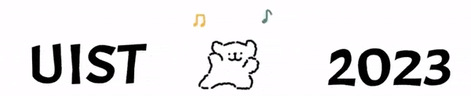

# Wakey-Wakey
This repository contains the source code for the paper *Wakey-Wakey: Animate Text by Mimicking Characters in a GIF*.




## How to Run

### Preliminary
Clone the repository and navigate into the project directory. Then follow the steps to set up the backend and frontend.

```bash
# Clone the repository
git clone https://github.com/KeriYuu/Wakey-Wakey.git
cd Wakey-Wakey/src

# Set up the backend
cd backend
conda create -n wakey python==3.10
conda activate wakey
pip install -r requirements.txt

# Set up the frontend
cd ../frontend
npm install
```

Download the pre-trained [FOMM model](https://github.com/AliaksandrSiarohin/first-order-model).
You may use the following command or manually download the file.

```bash
cd ../backend/models
wget https://disk.yandex.com/d/lEw8uRm140L_eQ/mgif-cpk.pth.tar
```

## Running the Server

To run the project, you need to start the backend and front-end servers.

```bash
# Start the backend server
cd backend
python run.py
```
```bash
# Start the frontend server in a new terminal
cd ../frontend
npm run serve
```

Now, navigate to `http://localhost:8080` in your web browser to use the application.


## Authoring System


The interactive user interface of Wakey-Wakey consists of three main views:

- **Input View**: Input text and customize its static appearance. You may also upload and preview the driving GIF. Click on the right arrow for the next step.
- **Correction View**: Adjust the key points of the animated text at specific frames. Click on the right arrow for the next step.
- **Refinement View**: You may refine the animation by adjusting the glyph's control points and configuring the algorithm’s parameters.

You can check the logs on the backend to monitor the generation progress.

## Key Components

1. **Driving Animation Key Point Extraction**: The project first extracts key points from the given GIF using a pre-trained [First-Order Motion Model (FOMM)](https://github.com/AliaksandrSiarohin/first-order-model).
2. **Key Point and Text Control Point Alignment**: The extracted key points are then aligned with the control points of the text to generate the animated text.

## Additional Notes
```bibtex
@inproceedings{
    title = {Wakey-Wakey: Animate Text by Mimicking Characters in a GIF},
    author = {Xie, Liwenhan and Zhou, Zhaoyu and Yu, Kerun and Wang, Yun and Qu, Huamin and Chen, Siming},
    booktitle = {Proceedings of the 36th Annual ACM Symposium on User Interface Software and Technology},
    doi = {10.1145/3586183.3606813},
    year = {2023},
    publisher = {ACM},
    address = {New York, NY, USA}
}
```


The final output is a GIF that animates the input text according to the movements in the input GIF.

## Performance

Wakey-Wakey is designed for efficiency. An automatic generation takes around 300ms/frame (CPU: Intel i7 4.9 GHz).
